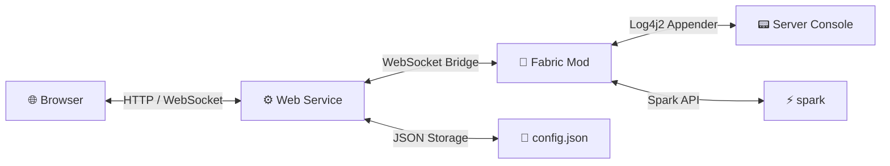

# Better Fabric Console


A modern, server-side Fabric mod for Minecraft 26.1.2 that hosts a local web-based administration interface directly from the Minecraft server itself. The mod serves as a runtime bridge, exposing metrics, console captures, and customizable controls without relying on external dashboard servers.

> Repository: https://github.com/MACULINX/better_fabric_console

---

## ✨ Features

| Feature | Description |
|---|---|
| 🌐 **Web-Based UI** | Full admin interface in the browser — no in-game menus needed |
| 📟 **Live Console** | Real-time server log streaming with color code rendering |
| ⚡ **Spark Integration** | Optional TPS, CPU & memory metrics via [spark](https://spark.lucko.me/) |
| 🔍 **Regex Filters** | Include, exclude or highlight log lines with custom rules |
| 🖱️ **Quick Actions** | Customizable command buttons with confirmation dialogs |
| 🔐 **Auth & Sessions** | SHA-256 master password, UUID session tokens, first-run wizard |
| 🔌 **Plugin System** | Toggle Spark and console capture on/off — UI adapts automatically |
| 📦 **Zero Bloat** | Spark used as `compileOnly` — never bundled in the final jar |

---

## 🏗️ Architecture



---

## 🔌 Plugin Support

> [!NOTE]
> **Optional Modules**
> Both Spark integration and live console streaming are **optional**. If either module is unavailable or disabled in `config.json`, the web UI automatically hides the corresponding panels. No restart required.

---

## 📁 Directory & File Structure

The project integrates the backend mod and frontend webapp into a unified source tree:
- **`src/main/java/...`**: Java source files including the Netty server, `AuthManager`, and JSON `Storage` wrapper.
- **`service/client/`**: React Vite web project compiling into single-page application bundle.
- **`src/main/resources/web/`**: Location where compiled frontend production assets are bundled during packaging.
- **`libs/`**: Local cache directory storing compile-time dependencies.

---

## ⚙️ Configuration

On first run, the mod generates a config folder under:
📂 `config/better_fabric_console/`

Inside `config.json`, the following configuration parameters are managed:
```json
{
  "serverName": "Minecraft Server Mod",
  "hostPort": 8000,
  "masterPasswordHash": "sha256_hash_here",
  "sessionTimeoutMinutes": 1440,
  "plugins": {
    "sparkEnabled": true,
    "consoleEnabled": true,
    "sparkInstalled": true
  },
  "filters": [],
  "quickActions": [
    {
      "id": "1",
      "name": "Save World",
      "command": "save-all",
      "color": "#10b981",
      "icon": "Save"
    }
  ]
}
```

---

## 🔨 Compilation & Installation

### Requirements
- **Java Development Kit (JDK)**: Version 25
- **Node.js & npm**: For compiling the React application

### Build Procedure
Run the standard gradle wrapper build task:
```bash
./gradlew build
```
This task automatically:
1. Navigates to `/service/client` and triggers `npm run build`
2. Copies the compiled production assets (`index.html`, javascript/css bundles) to Java resources (`/web`)
3. Compiles the Fabric mod classes
4. Packages a single, unified jar file under `build/libs/better-fabric-console-1.0.0.jar`

### Deployment
To install, copy the generated `.jar` file to your server mods directory:
```bash
cp build/libs/better-fabric-console-1.0.0.jar /path/to/your/minecraft/server/mods/
```

---

## 📜 License

This project uses a **dual license** depending on the component:

| Component | Path | License |
|---|---|---|
| Fabric Mod | `/src` | [GPL-3.0](LICENSE) + Parent Attribution |
| Web Service & Frontend | `/service` | [MIT](LICENSE) + Parent Attribution |

Any fork or derivative must include a visible link back to this repository:
**https://github.com/MACULINX/better_fabric_console**

> ⚠️ This project optionally integrates with [spark](https://spark.lucko.me/) (GPL-3.0-only). Spark is not bundled and must be installed separately on the server.

---

<div align="center">
Made with ☕ by <a href="https://github.com/MACULINX">MACULINX</a> —
<a href="https://github.com/MACULINX/Better-Fabric-Console">Better Fabric Console</a>
</div>
